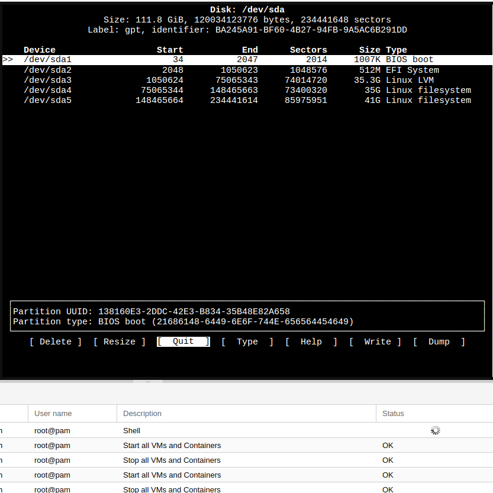

# install proxmox
* Mount disks

## Указываем uid дисов, именна дисков могу меняться
sudo blkid /dev/sdb1
automatically mounts
/etc/fstab

# Смотрим название
fdisk -l
# Разделяем диск
cfdisk /dev/sda

# mount
sudo mount /dev/sdb4 /mnt/disk4
